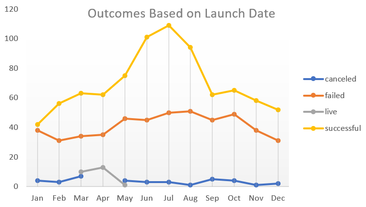

# An Analysis of Kickstarter Campaigns
An Excel file of completed analysis on Kickstarter Campaigns
## Visualizations

## Suggestions
1.Overall, the most successgul campaign are the theater campaigns, more specifically, the plays. 
2.May is the best time to start a campaign, as it shows in our analysis. On the other hand, December is not a very good time to start a campaign as December has the least number of successful campaigns. 
3.Generally, one of the reason campaigns fail is because the fundraising goal was set too high. However, the prime reason of a campaign failure is that the failed campaigns are less attractive to pledge people to donate. 
