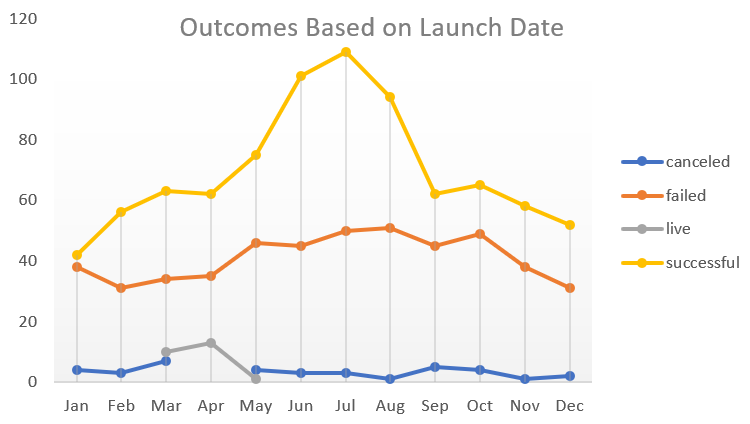
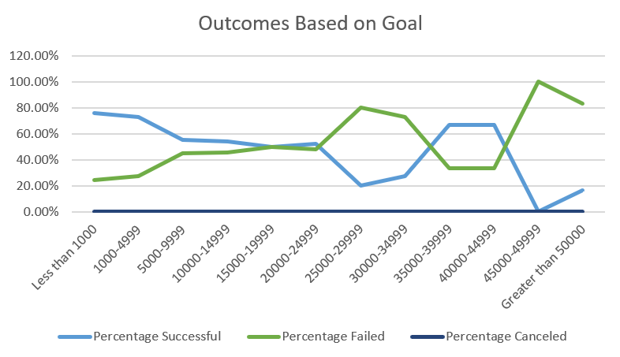

# Kickstarting with Excel

## Overview of Project

### Purpose
Louise, a playwright, wants to start a crowdfunding campaign to help her fund one of her plays. She is estimating a budget of over 10,000 dollars. This analysis is to uncover trends in the crowdfunding data to determine whether there are specific factors make her project campaign successful.
## Analysis and Challenges

### Analysis of Outcomes Based on Launch Date
The graph looks like a bell-shape facing downward that implies campaigns happening in the middle months of the year has higher chance of success. Canceled campaigns are below and around 10 per month with light fluctuation. Successful campaigns fluctuate within a wider ranger compare to failed campaigns. 

### Analysis of Outcomes Based on Goals
Generally, goals that are set under $20,000 has a higher chance of success than the ones higher than $20,000. However, goals set between $35,000-$45,000 also has a nearly 70% success rate. Goals that are exceeding $45,000 are at very high risk of failure.

### Challenges and Difficulties Encountered
1.When I was setting up a pivot table, there was a little struggle to figure out which tabs goes to where. For example, when I was doing Outcome Based on Launch Date, I first put outcomes in the row fields which did not work out to be a clear graph to analyze. However, when doing pivot table, I think it is better to try out different ways of putting data. Most of the times, I will gain better understandings on the data and make a stronger graph.
2. The biggest difficulty during the challenge was doing the CountIfs function for Outcomes Based on Goals. Since there are more than two criteria, for each function, it is very easy to get wrong on details. For example, since this is based on the subcategory of the plays, there should be a criterion to filter out “plays”. I was checking out mistakes on all the functions, and it did take time. At the end, I found a typo in my function where I put “plays” as “play”. I think one of the biggest challenges when dealing with long functions is to make sure every detail is correct. A little typo like this one, or a number, or even a decimal can make a whole spreadsheet heading towards the wrong direction.
## Results

- What are two conclusions you can draw about the Outcomes based on Launch Date?
Overall, the numbers of canceled campaigns are evenly distributed throughout the year. May and July are the best time to start a campaign. On the other hand, the beginning and the end of a year do seem to be a good time starting a campaign.
 The trend in theater outcomes are similar with the overall outcomes based on launch date. The best time to launch theater campaigns is around May. The beginning and the end of a year are not very good times to launch theater campaigns. There is zero rate of cancellation on theaters in October, but not very high success rate. So, I would suggest Louise to investigate projects happening in this month and focus on areas of improvement.
- What can you conclude about the Outcomes based on Goals?
There does not seem to be a direct relationship between goals and outcomes. However, goals that are set lower has a higher chance of success than failure. It does not mean that goals with higher goals will fail because between $39,999 and 49,999, there is still higher chance of success. As a result, there must be other factors affecting success rate of the campaigns. Overall, goals set higher than 50,000 would be considered too high or unrealistic in this case.
- What are some limitations of this dataset?
1.Data collected from different countries may vary causing by cultural differences.
2.Data collected from different sources can vary in quality.
3.Currency exchange rate at different time varies and affects data accuracy.
- What are some other possible tables and/or graphs that we could create?
1.A line graph on yearly trend on donation of the campaign 
2.A line graph on percentage successful, percentage failed of different countries at different times of a year
3.A line graph on goals and pledge amounts of different categories.
